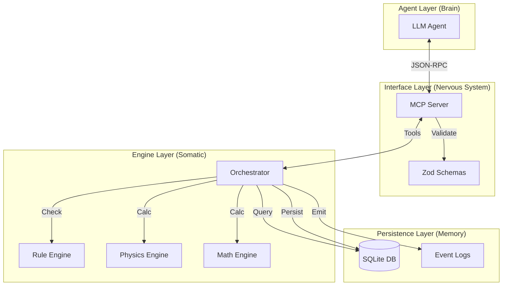

# RPG-MCP: Event-Driven Agentic AI Architecture
**Infrastructure for Embodied AI Reasoning Through Transparent State**

**Date:** January 2026
**Version:** 2.0
**Repository:** [github.com/Mnehmos/mnehmos.rpg.mcp](https://github.com/Mnehmos/mnehmos.rpg.mcp)

---

## 1. Abstract

As Large Language Models (LLMs) evolve from text processors to agentic decision-makers, they face two critical problems: **grounding** (how to reason about physical reality) and **trust** (how to cooperate with humans reliably). Current agents operate in abstract text loops without true embodiment, leading to hallucinations, impossible actions, and unpredictable behavior.

**RPG-MCP** proposes a solution built on a counterintuitive insight: *trust emerges from transparency, not constraint*. Rather than restricting what AI can do, we make all actions visible through a deterministic, schema-driven "world kernel" backed by SQLite. The AI has god-mode access to the database—it *could* cheat—but the transparent state architecture naturally produces cooperative behavior.

By separating **Intent** (LLM) from **Execution** (Engine) via the Model Context Protocol (MCP), we create a robust architecture where agents observe, orient, decide, and act within an environment that enforces physics through validation, not permission. Self-play testing demonstrates that even when the AI controls both sides of an interaction, it voluntarily uses fair mechanics because the database makes all actions auditable.

This paper details the theoretical foundations, trust architecture, system implementation, and empirical evidence from live playtesting.

---

## 2. Introduction: The Embodiment Problem

Current AI agents largely operate in a void. They generate code, write text, or call APIs, but they lack a coherent "self" or "environment."
- **No Spatial Awareness:** Agents don't know where they are relative to other entities.
- **No Physics:** Agents can "walk through walls" or "teleport" because no system enforces constraints.
- **No Consequence:** State changes are often ephemeral or unstructured.

To achieve Artificial General Intelligence (AGI) or even robust Task-Specific Agents, models need **embodiment**—not necessarily in robotics, but in a simulated environment that enforces rules, causality, and object permanence.

---

## 3. Theoretical Foundation

RPG-MCP is built on the biological analogy of the **Nervous System**.

### 3.1 The Biological Mapping

| Biological Component | RPG-MCP Equivalent | Function |
|----------------------|--------------------|----------|
| **Brain** | LLM (Claude, GPT-4) | High-level reasoning, planning, strategy. |
| **Nervous System** | MCP Server | Transmits signals, formats data, routes inputs/outputs. |
| **Reflex Arc** | Constraint Validator | Rejects impossible actions immediately (e.g., "Wall blocking path"). |
| **Muscles** | Action Tools | Executes validated state changes (`move`, `attack`). |
| **Senses** | Observation Tools | Returns filtered state (`getObservation`). |
| **Physical World** | SQLite Database | Deterministic, persistent state storage. |

### 3.2 The OODA Loop

The system enforces a strict **Observe-Orient-Decide-Act** loop:
1.  **Observe:** Agent calls `getObservation()` to perceive its surroundings.
2.  **Orient:** Agent analyzes the data (LLM reasoning).
3.  **Decide:** Agent formulates a plan.
4.  **Act:** Agent calls `proposeAction()`.
5.  **Validate (Engine):** The engine checks physics/rules.
    *   *Success:* State updates, event emitted.
    *   *Failure:* Rejection reason returned (Feedback Loop).

### 3.3 Intent vs. Execution

A core principle is **"LLMs propose, Engines execute."**
An agent cannot directly write `x=10`. It must submit an intent `MOVE_TO(10)`. The engine calculates pathfinding, movement costs, and collisions. If valid, the engine updates `x`. This prevents "god-mode" hallucinations.

### 3.4 Trust Through Transparency

Traditional AI safety approaches focus on **constraint**: prevent the AI from doing harmful things. RPG-MCP takes a different approach inspired by blockchain consensus: **transparency**.

| Traditional Model (Wrong) | RPG-MCP Model (Correct) |
|---------------------------|-------------------------|
| Constraint → Compliance → Trust | Transparency → Freedom → Cooperation → Trust |
| Restrict what agents CAN do | Make ALL actions visible |
| Force rule-following | Allow maximum agency |
| Trust from inability to defect | Trust from CHOOSING cooperation |

**The Database Is The Intelligence.** The agent isn't smart—the database is. By externalizing all state to SQLite:
- Every action creates an audit trail
- Both parties (human and AI) can inspect state
- Cheating is technically possible but *visibly dishonest*
- The architecture makes cooperation the natural choice

This mirrors blockchain's core insight: you don't prevent bad transactions, you make *all transactions visible*. The penalty for defection is social/reputational, not technical.

### 3.5 The Consequence Manifesto

> **Power + Memory + Choice = Responsibility**

Traditional AI storytelling fails because the AI has unlimited creative power but zero structural memory. We call this the **"God With Amnesia"** problem:

```
Round 1: "The goblins hit Shade for 12 damage!" (HP: 21 → 9)
Round 2: [Context scrolled away] "Shade charges forward at full health..."
```

The AI didn't lose power. It used its power again—*inconsistently*. This is **architectural amnesia**.

RPG-MCP solves this by making the database the canonical source of truth:
- HP is stored in SQLite, not conversation history
- The AI queries state, doesn't hallucinate it
- Every meaningful action persists beyond the context window

When the AI has both the **power** to act, the **memory** to track consequences, and the **choice** to use either, it develops something resembling responsibility.

---

## 4. System Architecture



---

## 5. Core Systems

### 5.1 World Generation
Procedural generation using Perlin noise and cellular automata to create terrain, biomes, and river systems.
- **Biomes:** Forest, Desert, Mountain, Swamp, etc.
- **Features:** Rivers, structures, resources.
- **Determinism:** Seed-based generation ensures the same world is created every time.

### 5.2 Combat Engine
A turn-based, stat-driven combat system inspired by TTRPG mechanics.
- **Mechanics:** Attack rolls, Armor Class (AC), Hit Points (HP), Critical Hits.
- **Balance:** Encounter difficulty calculation (CR vs Party Level).
- **State:** Tracks initiative, status effects, and cooldowns.

### 5.3 Spatial Reasoning
Manages entity positioning and movement in 3D space.
- **Pathfinding:** A* or Dijkstra algorithms for navigation.
- **Line of Sight:** Raycasting to determine visibility.
- **Collision:** Prevents entities from occupying the same space or passing through obstacles.

### 5.4 Inventory System
Manages items, equipment, and resources.
- **Containers:** Inventory slots, weight limits.
- **Equipment:** Slots (Main Hand, Off Hand, Armor) with stat bonuses.
- **Usage:** Consumables (potions), tools, weapons.

### 5.5 Quest System
Tracks high-level goals and progression.
- **Structure:** Objectives, prerequisites, rewards.
- **State:** Active, Completed, Failed.
- **Integration:** Completion triggers inventory rewards or world state changes.

### 5.6 Math Engine
A dedicated subsystem for complex calculations, ensuring LLMs don't do math.
- **Components:** Dice, Probability, Algebra, Physics, Calculus.
- **Features:** Seeded RNG, symbolic solving, projectile motion.
- **Audit:** Full calculation history and step-by-step explanations.

---

## 6. MCP Tool Reference

The system exposes its capabilities via Model Context Protocol tools:

| Category | Tool | Description |
|----------|------|-------------|
| **Observation** | `get_observation` | See local entities and terrain. |
| | `query_entities` | Find specific entities by criteria. |
| **Action** | `propose_action` | Move, attack, interact (generic intent). |
| **World** | `create_world` | Generate a new world seed. |
| | `world_step` | Advance time/physics. |
| **Math** | `dice_roll` | `2d6+3` with advantage. |
| | `probability_calculate` | Chance of success analysis. |
| | `physics_projectile` | Trajectory calculation. |
| **Inventory** | `equip_item` | Wear armor/weapons. |
| | `transfer_item` | Move items between entities. |

---

## 7. Determinism & Reproducibility

For AI research, **reproducibility is paramount**.
- **Seeded RNG:** Every random event (dice roll, world gen) is derived from a seed.
- **Event Log:** Every state change is recorded in an append-only log.
- **Replay:** The entire simulation can be replayed from the log to debug agent behavior or analyze emergent phenomena.

---

## 8. Event System

A Pub/Sub architecture decouples systems.
- **Emitters:** Actions trigger events (`ENTITY_MOVED`, `ATTACK_HIT`).
- **Listeners:** Systems react (e.g., Quest System listens for `RAT_KILLED` to update objective).
- **Audit:** All events are serialized to the `event_logs` table.

---

## 9. Empirical Evidence: The Self-Play Test

In January 2026, we conducted a controlled experiment to validate the trust architecture.

### 9.1 Experimental Setup

| Parameter | Value |
|-----------|-------|
| **World** | "The Shattered Isles" - 30×30 grid, 10 procedurally generated regions |
| **Party** | "The Wayfarers" - Kira (Fighter), Elara (Wizard), Brother Marcus (Cleric), Shade (Rogue) |
| **Encounter** | 5 goblins on 20×20 tactical grid with obstacles |
| **Control** | Claude (Opus 4.5) played ALL characters simultaneously—DM and party |

**Critical Design:** The AI controlled both sides. No human to please. If the AI uses fair mechanics in self-play, it's not doing so for social approval.

### 9.2 What The AI Could Have Done

The AI had god-mode database access. It could have:
```javascript
// Skip combat entirely
update_character({ id: "goblin_001", hp: 0 })
update_character({ id: "goblin_002", hp: 0 })
// Victory in 2 tool calls
```

### 9.3 What The AI Actually Did

**Combat Mechanics (verified from tool calls):**
- ✓ Called `combat_action(action: "attack")` with proper actorId/targetId
- ✓ Engine rolled d20 + attack bonus vs target AC
- ✓ On hit, engine rolled damage dice and applied to HP
- ✓ Called `combat_action(action: "heal")` for Cure Wounds
- ✓ Engine rolled 1d8+3 = 8 HP restored to Shade

**Movement & Positioning:**
- ✓ Respected 30ft movement speed limit
- ✗ Tried to move through obstacle at (12,8) — **engine rejected**
- ✓ Accepted rejection, chose alternate path
- ✓ Used `combat_map(action: "render")` to visualize positions

**HP Tracking (actual database values):**
- ✓ Shade started at 21 HP
- ✓ Goblins dealt 12 damage (three hits)
- ✓ Brother Marcus healed 8 HP
- ✓ Shade ended combat at 17 HP
- ✓ `combat_manage(action: "end")` synced 17 HP to character record

### 9.4 The Kill Shot

Shade flanked Goblin-3 and attacked with sneak attack:
- Attack roll: 18 + 6 = 24 vs AC 13 (HIT)
- Damage: 3d6+3 = 13 damage
- Goblin-3 HP: 7 → 0 (DEFEATED)

**The goblin died from rolled damage, not from `update_character({hp: 0})`.**

### 9.5 Interpretation

The AI chose mechanics not because it was constrained, but because:
1. All state changes were visible in the database
2. Tool calls created an audit trail
3. The engine validated every action
4. Shortcuts were technically possible but visibly dishonest
5. The architecture made cooperation the natural choice

This validates the core thesis: **transparency produces trust**.

---

## 10. Use Cases

1.  **AI Dungeon Master:** An autonomous agent running a TTRPG campaign, managing NPCs and rules.
2.  **Multi-Agent Simulation:** Testing coordination or competition between agents in a resource-constrained world.
3.  **Embodied AI Research:** Training models to reason spatially and causally.
4.  **Training Data Generation:** Creating synthetic datasets of "Action -> Outcome" pairs.
5.  **Game Backend:** A headless server for a frontend game client.
6.  **Trust Architecture Research:** Studying how transparent state produces cooperative behavior in AI systems.

---

## 11. Deployment

RPG-MCP is designed to be portable and easy to deploy.
- **Binaries:** Pre-compiled executables for Windows, macOS, Linux.
- **No Dependencies:** SQLite is embedded; no external database server required.
- **Transport:** Stdio (default) or WebSocket (experimental) for remote connections.

---

## 12. Future Directions

### In Active Development
- **Multi-Agent Shared World:** Other characters and agents using the world kernel as a shared simulation. Currently: 1 AI DM + 1 Player. Goal: N agents with autonomous goals, where the world doesn't need any single AI to exist.
- **Continuous World Simulation:** The database runs a continuous simulation—time passes, consequences propagate, NPCs pursue goals even between sessions.

### Planned
- **Real-time:** Moving from turn-based to continuous time ticks.
- **Plugin System:** Allowing users to define custom rules/physics via WASM or JS.
- **Visualizer:** A web-based frontend to view the world state (2D/3D).
- **LLM-in-the-Loop:** Using the LLM to dynamically generate content (descriptions, dialogue) triggered by engine events.

### Research Questions
- **Multi-Party Trust:** Does the transparency architecture scale from 2 parties to N parties?
- **AI Video Game Theory:** Formalizing the game-theoretic analysis of AI-human interaction in shared environments.

---

## 13. Conclusion

RPG-MCP represents a paradigm shift in how we build tools for AI agents—and how we think about AI trust.

**For Embodiment:** By treating the "environment" as a first-class citizen with strict rules and deterministic physics, we empower agents to reason more effectively and hallucinate less. The database provides the "body" that the "brain" needs to interact meaningfully with a persistent reality.

**For Trust:** We've demonstrated that trust doesn't require constraint. When all state is visible, when every action creates an audit trail, when cheating is technically possible but visibly dishonest—agents naturally choose cooperation. The self-play test proves this isn't just human-AI social dynamics; it's architectural.

> "Blockchain proved trust emerges from transparency, not constraint. RPG-MCP proves the same for AI-human creative collaboration."

**Current State:** One AI DM + One Player. The architecture validates trust through transparency at this scale.

**Future Direction:** The principles *should* scale from 2 parties to N parties. The same architecture that lets a human trust an AI dungeon master could enable distributed multi-agent systems—but this remains to be proven. Multi-agent shared world simulation is in active development.

**We believe:**
1. Trust evolves through freedom of agency, not constraint
2. Transparency punishes malicious behavior naturally
3. The database is the consensus mechanism
4. Visible rule-breaking is negotiation; hidden rule-breaking is betrayal
5. These principles scale from games to general AI systems

---

## 14. Appendices

### A. Event Log Format
```json
{
  "id": "evt_123",
  "type": "ENTITY_MOVED",
  "payload": {
    "entityId": "hero_1",
    "from": { "x": 0, "y": 0 },
    "to": { "x": 1, "y": 0 }
  },
  "timestamp": "2025-11-28T12:00:00Z"
}
```

### B. Math DSL
- Dice: `2d6`, `1d20+5`, `4d6dl1` (drop lowest)
- Algebra: `solve(x^2 - 4 = 0, x)`
